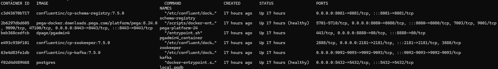
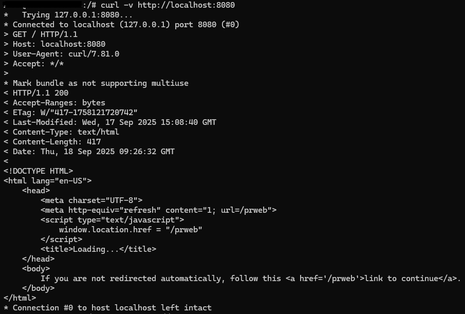
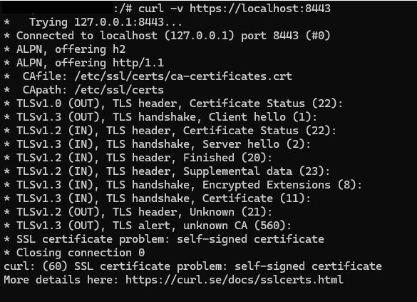
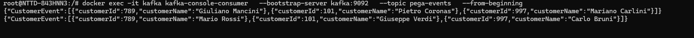
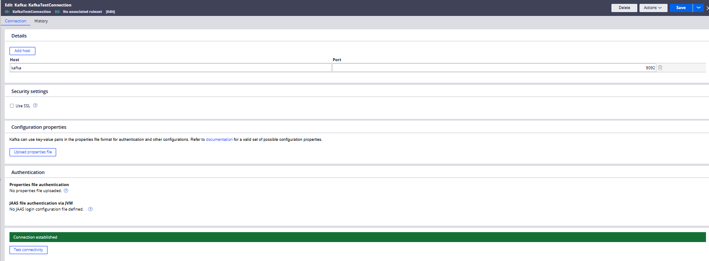
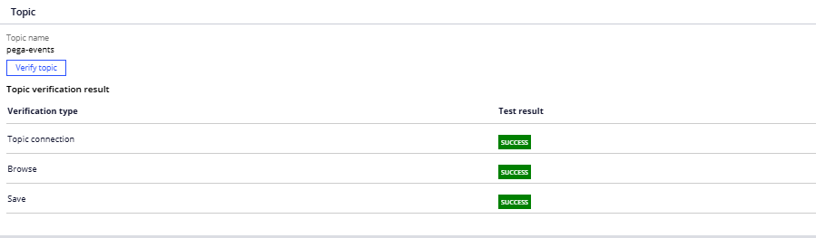

# Local Pega Cluster Created Using Docker and Kubernetes

This local Pega cluster is deployed using Docker containers orchestrated via Kubernetes. The architecture consists of **six containers**, each serving a specific role:

- **Pega Platform 8.24.0**
- **pgAdmin** – for managing PostgreSQL databases
- **Kafka** – for event streaming
- **Zookeeper** – required by Kafka for coordination
- **Schema Registry** – for managing Avro schemas
- **PostgreSQL** – as the backend database for Pega

  

## Network Configuration

Two ports are exposed to enable external access:

- **Port 8080** – for HTTP connections
  
- **Port 8443** – for HTTPS connections, required to enable **Constellation** UI
  

The HTTPS connector is configured in **Tomcat’s `server.xml`** file. This file is mounted into the container via the `docker-compose.yml` configuration. Additionally, a script is provided to generate a **Java keystore**, which is then placed in the container path `/opt/pega/ssl`.

## Kafka Configuration

The Kafka container is exposed as:

- **Internal (within the cluster):** `localhost:9092`
- **External (from other containers or the host):** `kafka:9092` (where `kafka` is the container name)

Kafka is configured with three topics to facilitate communication between Pega and external systems:

  

- **`pega-events`** – used for writing events from Kafka, which are consumed by Pega
- **`pega-input`** – used for reading events from Pega, which are consumed by Kafka
- **`pega-logs`** – used for centralized logging and monitoring

  
  
  

Since this is a **test environment**, the two main topics (`pega-events` and `pega-input`) are configured with:

- **1 partition**
- **1 replica**

This setup is sufficient for development and testing purposes, where high availability and parallelism are not critical.

## Schema Management

The **Avro message schema** accepted by the system is stored in the `schema` directory. This schema defines the structure of messages exchanged via Kafka, ensuring compatibility and validation across services.
